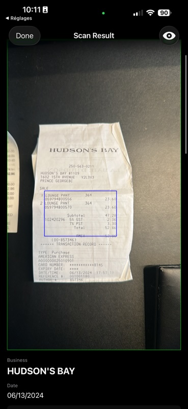
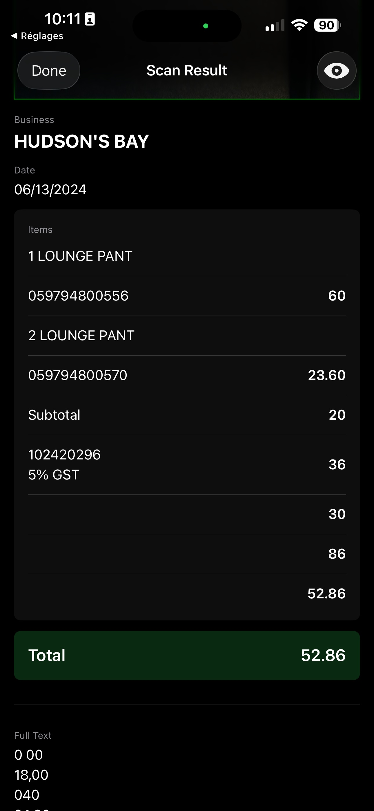

# Swift Demos

A monorepo for testing Swift and iOS development concepts with Apples Machine Learning APIs 

## Projects

###  ml-recognize-doc-request

An implementation of Apple's RecognizeDocumentRequest API that turns your camera into a receipt scanner. The app uses AVFoundation to capture photos and Vision's document recognition to extract structured data from receipts. Each scan returns the business name, date, line items with prices, and the total. The bounding box overlay uses color coding to show different element types detected by the model - green for text, blue for tables, orange for lists, and purple for barcodes. Everything runs on-device with no network dependency.

|  |  |
|:---:|:---:|
| Live camera feed with capture button | Scanned receipt with bounding box visualization |

Features:
- Real-time camera preview with live frame handling
- Photo capture with automatic document recognition
- Structured data extraction: business name, date, line items, totals
- Color-coded bounding boxes for text, tables, lists, and barcodes
- Toggle between annotated and original image views
- Full-text fallback display for unrecognized structures

###  ml-image-parse
An image parsing app that demonstrates Vision and ML frameworks for text recognition. Features:
- Image gallery with sample receipts and signs
- Text recognition using Vision framework
- Translation capabilities
- Bounding box visualization for detected text

###  ml-analyze-sentiment
A sentiment analysis app that uses Natural Language framework to analyze user opinions about hiking. Features:
- Text input for collecting user opinions
- Real-time sentiment scoring using NL framework
- Chart visualization of sentiment distribution
- Response history with sentiment indicators

## Requirements

- iOS 17.0+
- Xcode 15.0+
- Swift 5.9+

## Usage

Each project is a standalone iOS app that can be opened and run in Xcode:

1. Open the desired `.xcodeproj` file
2. Select a simulator or physical device
3. Build and run (⌘+R)

## Purpose

This repository serves as a personal testing ground for:
- Apple's ML and Vision frameworks
- SwiftUI best practices
- Natural Language processing
- Text recognition and computer vision
- Data visualization with Swift Charts

## Development Notes

- Projects are organized as separate Xcode projects for easy testing
- Sample data and assets are included for immediate testing
- Code follows Swift conventions and Apple's recommended patterns
